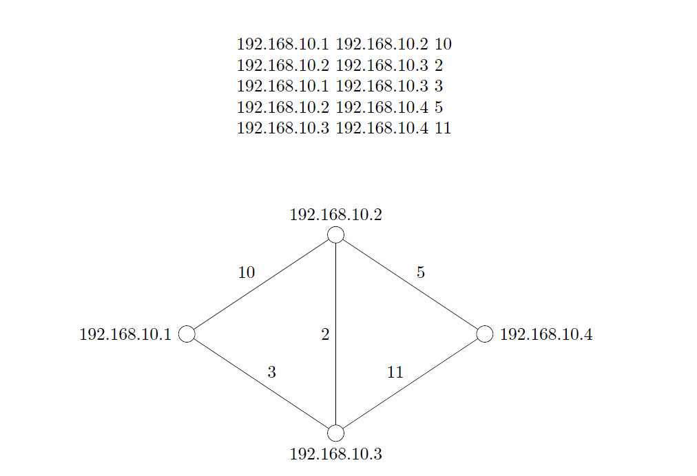

# Network layer simulation : Distance vector routing protocol

#  DVR Implementation

## 1 Introduction

In this assignment you will implement Distance Vector Routing (DVR) protocol.
You must word withUNIX sockets, so you have to use a UNIX based machine.
The codes were tested on Ubuntu, but pretty much any Linux distro/Mac OS
should work just fine. Moreover, as you will be configuringiptablesand ports,
it is strongly suggested that you work on aVirtual Machineinstead of your
native OS. Chances are, even if things go wrong it won’t do any permanent
damage - but let’s not take the risk at the first place.You have to complete
this assignment in C++.

## 2 Overview

For this assignment we are going to providethreefiles to you -

1. a setup file (setup),
2. a topology file (topo.txt), and
3. a driver program (driver.py).

Your job is to write the fourth file - therouter program.
The setup file configures virtual interfaces so that we can emulate routers
having different IP addresses on the same machine, the topology file describes
the network topology, and the driver program provides necessary commands to
the routers. All messages are transmitted among entities through User Data-
gram Protocol.

## 3 The Setup File

The setup file contains someifconfigcommands. Bascially it creates some
virtual network interfaces and attaches an ip address to it. Let’s take a closer
look at the first command, all other commands are similar:


sudo ifconfig eth0:1 192.168.10.1 netmask 255.255.255.0 up

Notice that we have to execute these commands with elevated privileges. The
first parameter toifconfigis the virtual interface, the second is its IP address.
Keep in mind that based on your OS, interface name might differ.
We will configureeth0:xto have the IP address192.168.10.x. Finally we are
assigning the network mask to be255.255.255.0and activating the interface.
We are going to assumedriver program’s address is 192.168.10.100.
For the most part of this assignment, you won’t have to modify this setup
file. The only case when you have to modify this is if we ask you to create a
topology with more than four routers. For example, if we ask you to create a
topology with 6 routers, you will copy any line and paste it twice (we already
have five addresses setup, four routers and one driver, so we need two more
routers). Then you are going to change network interface of the pasted lines
to eth0:5 and eth0:6, and IP addresses to 192.168.10.5 and 192.168.10.6. Don’t
change the netmask. Finally you are going to execute this setup file. As a rule
of thumb, always execute this setup file everytime you change it.

## 4 The Topology File

The topology file describes our network topology through a bunch of statements
having the following format:

<router1 address> <router2 address> <link cost>

So we get two infomation from each of the statements:

1. there is a link between router1 and router2 i.e. they can send and receive
    messages to each other, and
2. the cost associated with that link.

For you convenience the contents of the supplied topology file - ‘topo.txt’ along
with the topology it describes is illustrated in Figure 1.




```
Figure 1: Network topology represented by topo.txt
```
Be advised that when we check your offline, we might tell you to create a
new topology file or modify the existing one. Depending on how many routers
we want in our topology,you might have to modify the setup file.

## 5 The Driver Program

The driver program is theGOD-entity- it knows the whole topology, it can
update link cost, it can deactivate a link, it can reactivate the deactivated link, it
can ask a router to send a message to another router. However, we are going to
assume it does not have the authority to create a totally new link. For example,
in the topology described previously, there is no link between 192.168.10.1 and
192.168.10.4. The driver will not be able to create a link between these two.
But there is a link between 192.168.10.1 and 192.168.10.2 having a cost of 10.
The driver has the authority to deactivate this link, reactivate this link, and
change the link cost. We can input commands to the driver from the terminal.
For your assignment you will not really need to know much about this driver
other than the information provided in the following subsections, but feel free
to go through the code if it interests you. Be advised, although you are allowed
to examine the driver program,you are not allowed to modify the driver
code in any way.


### 5.1 Technical Details

- The driver program is written in python 2.x, it has not been tested on
    python 3.x.
- It binds itself to the IP address 192.168.10.100 and the port 4747.
- It assumes the routers will bind on the same port i.e. 4747.
- You can assume the driver will be started only after all routers are up and
    running.
- The driver can be invoked bypython driver.py <topology-file>.

### 5.2 Available Commands

- help- shows a list of available commands.
- hosts- shows a list of routers.
- cost〈ip 1 〉〈ip 2 〉〈cost〉- updates link cost to〈cost〉between routers having
    ip addresses of〈ip 1 〉and〈ip 2 〉. Be advised, this message is sent to only
    the relevant routers. Once this command is issued, the driver writes a
    message of the following format to the socket:

```
cost<ip1><ip2><value>
```
```
Here ‘cost’ takes up 4 bytes, ‘ip1’ and ‘ip2’ take up 4 bytes (one for each
of its segment) each, and ‘value’ takes up 2 bytes. So in total 14 bytes are
sent out through the socket.
```
- down〈ip 1 〉 〈ip 2 〉- deactivates link between routers having ip addresses
    of〈ip 1 〉and〈ip 2 〉. When we ‘deactivate’ a link, no packets can be sent
    using that link. Be advised that this change is sustained till you counter
    it with the followingupcommand. It calls a shell command that requires
    elevated privileges. The restriction is automatically imposed by the OS.
    Your job is to recognize a link failure and make necessary changes to your
    routing table. More on this in subsection 6.4.
- up〈ip 1 〉 〈ip 2 〉- reactivates link between routers having ip addresses of
    〈ip 1 〉and〈ip 2 〉. Be advised that this change is sustained till you counter
    it with the abovedowncommand. It calls a shell command that requires
    elevated privileges.
- send〈ip 1 〉 〈ip 2 〉 〈message−length〉 〈message〉- instructs the router
    having ip address of〈ip 1 〉to send〈message〉of length〈message−length〉
    to the router having ip address of〈ip 2 〉. Be advised, this message is sent
    to the first router only. Once this command is issued, the driver writes a
    message of the following format to the socket:


```
send<ip1><ip2><message-length><message>
```
```
Here ‘send’ takes up 4 bytes, ‘ip1’ and ‘ip2’ take up 4 bytes (one for
each of its segment) each, ‘message-length’ takes up 2 bytes, and ‘mes-
sage’ takes up ‘message-length’ number of bytes. Assuming our message
ishello world!, 26 bytes are sent through the socket (message being 12
characters long).
```
- show〈ip〉- instructs router having ip address of〈ip〉to print its routing
    table. Once this command is issued, the driver writes a message of the
    following format to the socket:

```
show<ip>
```
```
Here ‘show’ takes up 4 bytes, ‘ip’ takes up 4 bytes (one for each of its
segment).
```
- clear- clears the screen.
- exit- terminates the driver.

### 5.3 Link ‘up’ and ‘down’ Command - What’s Happening

### under the Hood

In subsection 5.2 you were introduced with two driver commands: upand
down. In this subsection we are going to take a look at the ‘magic’ that’s
happening behind the scenes. This subsection has been added so that you get
a clear idea exactly how we are forcing a particular link to fail. You can safely
skip this if you want - it is not going to help you in completing your assignment
directly. That being said, a bit of extra knowledge will never harm you.
There is a tool namediptableswhich is used to maintain IPv4 packet fil-
tering rules. Using this very tool we can force packets to be dropped between
two IP addresses. Let’s take a look at a particular command to get a practical
idea:

sudo iptables -I OUTPUT -s 192.168.10.1 -d 192.168.10.2 -j DROP

The above command basically says: insert a rule in our iptables (iptables -I)
specifying that, if we send out (OUTPUT) a packet from source (-s 192.168.10.1)
to destination (-d 192.168.10.2), simply drop it (-j DROP). As by link failure
we mean no router can send packets to the other, we have to write another
command with source and destination interchanged. To change our rule so that
the packets are accepted, we need to invoke the above command again with a
minor change - we need to replace ‘DROP’ with ‘ACCEPT’.
That was a pretty shallow intro toiptables, if this seems interesting to you,
simply check out the manpage for more details.


## 6 Your Task - the Router Program

You have to write the router inC++. Suppose you compile yourrouter.cpp
file into the executablerouter. Assuming you are on the same directory as your
executable, you should be able to invoke your router as

./router <ip address> <topology-file>

A step by step functionality of a router is presented in the following subsections.

### 6.1 Host and Neighbor List Formation

A router should extract list of routers in the network from the topology file.
It should be able to find out its neighbors from the topology file along with
associated links. Be advised it should not store any other information from the
topology file. For example, in our given topology 192.168.10.1 is connected to
both 192.168.10.2 and 192.168.10.3. So the cost of these two links should be
stored by our first router, but information regarding all other links should be
ignored. Once a router is up and running, it should print its initial routing table
once.

### 6.2 Routing Table Maintenance

Each router should maintain its own routing table. The routing table should
contain entries for each of the routers in the network. It should store two
information in each entry - next hop to reach the destination and the total cost
to reach the destination. For example, first time router 192.168.10.1 is run, its
routing table will be something like this:

destination next hop cost
----------- -------- ----
192.168.10.2 192.168.10.2 10
192.168.10.3 192.168.10.3 3
192.168.10.4 - <some-predefined-value>

The last entry denotes that the final destination is unreachable. The routing
table might need to be updated on the following occasions:

1. when a neighbor sends its routing table,
2. when a link cost is updated,
3. when a link is deactivated, and
4. when a link is reactivated.

You are going to print the routing table once at startup, and whenevershow <ip>
command is invoked.


### 6.3 Periodic Update of Routing Table

Each router will exchange its routing table with its neighbors only. The exchange
should be periodical at five seconds interval.

### 6.4 Detection of Link Failure

We can deactivate a link by invoking thedowncommand from our driver, as
described in subsection 5.2. A link will be considered to be deactivated when
no update is received for three consecutive update intervals. For example, if
192.168.10.1 and 192.168.10.2 do not receive routing table updates from each
other for three consecutive times, they are going to consider the link between
them is down. Be advised, there might be other ways to detect link failure,
butthis is the only method that you are allowed to use to detect link
failure. We can reactivate a link by invoking theupcommand from our driver,
as described in subsection 5.2.

### 6.5 Receiving Messages from the Driver

Each router should be able to receive messages from the driver. As discussed
previously, there are two kinds of messages - one for updating link cost and
another for passing messages between routers.

6.5.1 Link Update Message

A router should be able to recognize the link update messages as discussed in
subsection 5.2.

6.5.2 Send Message

A router should be able to recognize the send messages as discussed in subsec-
tion 5.2. Once a router receives the send command from our driver, it should
perform necessary packet forwarding activities.

### 6.6 Packet Forwarding

We are using the work ‘packet’ in a pretty loose sense here, any message between
two routers is a ‘packet’. Suppose we invoke the send command as follows:

send 192.168.10.1 192.168.10.4 5 hello

Let us further assume that this hello packet takes the following path to reach
from 192.168.10.1 to 192.168.10.4:

192.168.10.1 -> 192.168.10.3 -> 192.168.10.2 -> 192.168.10.

Actually this is the exact same path the packet is supposed to take consider-
ing our given topology. Now once 192.168.10.1 receives the send command, it
should lookup its routing table to find the next hop to reach 192.168.10.4. It’s


going to find that the next hop is 192.168.10.3, so it should send a message to
192.168.10.3:

frwd 192.168.10.4 5 hello

Be advised,this message should be sent to 192.168.10.3 (the next hop
router) only. Once 192.168.10.3 receives the forward message, it in turn per-
forms a table lookup and forwards the packet. This goes on until the packet
reaches the destination.You need to print messages on the console stat-
ing these forwarding events. So a typical sequence of messages for the above
scenario might be something like this:

hello packet forwarded to 192.168.10.3 (printed by 192.168.10.1)
hello packet forwarded to 192.168.10.2 (printed by 192.168.10.3)
hello packet forwarded to 192.168.10.4 (printed by 192.168.10.2)
hello packet reached destination (printed by 192.168.10.4)

## 7 A Sample Sequence of Driver Commands

In the previous sections, we took a look at all the available driver commands and
their possible effects. Just for the sake of cohesiveness, let’s see the behavior
of our routers for a sequence of driver commands. We are going to work on
the same topology that we have been studying so far, see Figure 1 to jog your
memory. Recall that you can instruct a router to show its routing table by the
show <ip>command.

```
1.Run all the routers, then run the driver.
The routers show their initial routing table as each of them are run.
```
```
2.send 192.168.10.1 192.168.10.4 5 hello
‘hello’ reaches destination following this path: 1 -〉3 -〉2 -〉4.
```
```
3.cost 192.168.10.1 192.168.10.2 2
Routing tables are updated as required.
```
```
4.send 192.168.10.1 192.168.10.4 11 hello again
‘hello again’ reaches destination following this path: 1 -〉2 -〉4.
```
```
5.down 192.168.10.1 192.168.10.
OS level call made to drop packets through the link between 1 and 2.
```
```
6.send 192.168.10.1 192.168.10.4 3 bye
Assuming the above command was invoked before the adjacent routers de-
tected link failure and converged, this message will not reach destination.
```
```
7.send 192.168.10.1 192.168.10.4 9 bye again
Assuming the adjacent routers detected the failure by this time and they
converged, ‘bye again’ will reach destination following this path: 1 -〉3 -〉
2 -〉4.
```

8. If you invoke up command and send the previous message, the message
    will reach destination using the former path i.e. 1 -〉2 -〉4.


## 8 Acknoledgement

- Nazmus Saquib, Lecturer, Department of CSE, BUET
- This project is done for CSE322 : https://github.com/lsiddiqsunny/CSE-322-Computer-Networks-Sessional/


